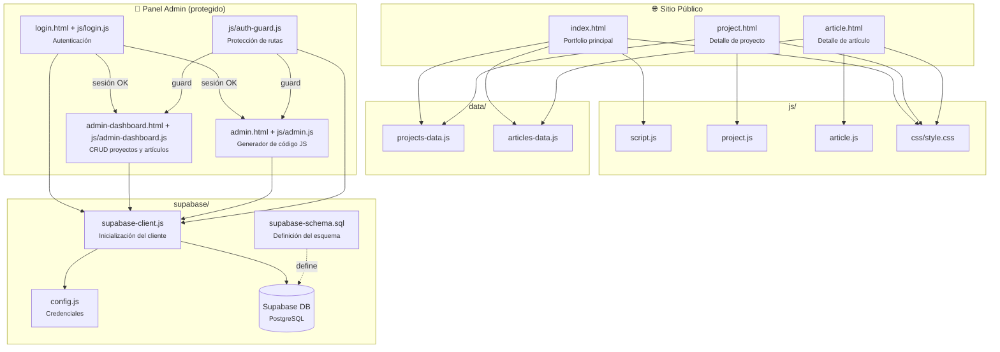

# geramaargonzalez.github.io

Portfolio personal de **Gerardo González** — NetSuite Administrator · Developer · Data & AI, desplegado en [GitHub Pages](https://pages.github.com/).

## 🌐 Sitio en vivo

[https://geramaargonzalez.github.io](https://geramaargonzalez.github.io)

## 📋 Descripción

Este repositorio contiene el código fuente de mi sitio web personal y portfolio profesional. Está construido íntegramente con **HTML, CSS y JavaScript vanilla** (sin frameworks ni dependencias externas) y usa **Supabase** como backend para la gestión dinámica de contenido del CMS administrativo.

El sitio presenta mi perfil profesional como especialista en NetSuite, desarrollo de integraciones y análisis de datos, con un foco especial en la formación académica en Ciencia de Datos e IA (UTEC + MIT).

---

## 🗂️ Estructura del proyecto

```
geramaargonzalez.github.io/
│
├── 📄 Páginas (raíz — requerido por GitHub Pages)
│   ├── index.html              # Página principal del portfolio
│   ├── project.html            # Vista de detalle de proyecto
│   ├── article.html            # Vista de detalle de artículo
│   ├── login.html              # Página de inicio de sesión
│   ├── admin-dashboard.html    # Dashboard: gestión de proyectos y artículos
│   └── admin.html              # Generador de código JS para proyectos/artículos
│
├── css/
│   └── style.css               # Estilos globales (variables, layout, responsive)
│
├── js/
│   ├── script.js               # Funcionalidades del sitio (navbar, scroll, etc.)
│   ├── project.js              # Lógica de la página de detalle de proyecto
│   ├── article.js              # Lógica de la página de detalle de artículo
│   ├── login.js                # Lógica de autenticación vía Supabase Auth
│   ├── admin-dashboard.js      # Lógica CRUD del dashboard
│   ├── admin.js                # Lógica del generador
│   └── auth-guard.js           # Guard: protege rutas admin verificando sesión activa
│
├── data/
│   ├── projects-data.js        # Array de proyectos (fallback / datos locales)
│   └── articles-data.js        # Array de artículos (fallback / datos locales)
│
├── supabase/
│   ├── supabase-client.js      # Inicialización del cliente Supabase
│   ├── config.js               # Credenciales (SUPABASE_URL + ANON_KEY) — en .gitignore
│   ├── config.example.js       # Plantilla de credenciales (sin datos sensibles)
│   └── supabase-schema.sql     # Esquema SQL de la base de datos
│
├── assets/                     # Imágenes, logos, CV, datasets
│
├── README.md
└── SUPABASE_SETUP.md           # Guía de configuración de Supabase
```

---

## 🏗️ Arquitectura del proyecto



---

## 📄 Secciones del sitio

### 1. Navbar
Barra de navegación fija con logo, enlaces a cada sección y menú hamburguesa para móvil. Se añade sombra automáticamente al hacer scroll.

### 2. Hero
Sección principal con foto de perfil, nombre, título profesional, descripción breve, ubicación (Montevideo, Uruguay) y botones de acción para navegar a proyectos, descargar CV o ir a contacto. Incluye badge de la especialización académica UTEC + MIT.

### 3. Sobre mí
Descripción ampliada del perfil profesional: experiencia en NetSuite, habilidades de desarrollo (SuiteScript, JavaScript, Python), orientación analítica y la especialización en curso en Ciencia de Datos e Inteligencia Artificial. Incluye una tarjeta destacada con la información académica.

### 4. Skills & Stack
Skills agrupadas en cuatro categorías:
- **ERP & NetSuite**: NetSuite, SuiteScript 2.x, SuiteFlow, SuiteTalk (SOAP/REST), NetSuite Administration
- **Desarrollo**: JavaScript, Node.js, Python, REST APIs, SQL, HTML/CSS
- **Data & AI**: Machine Learning, Inteligencia Artificial, Análisis de Datos, Python (Pandas, NumPy), SQL Analytics
- **Integraciones & Herramientas**: Git/GitHub, Postman, VS Code, Automation

### 5. Proyectos destacados
Grilla de tarjetas con seis proyectos profesionales/personales:
1. **NetSuite Integration Hub** — Plataforma modular de integración con APIs REST (Node.js, SuiteScript)
2. **Sales Dashboard Analytics** — Dashboard de análisis de ventas y forecasting (Python, Pandas, SQL)
3. **AutoFlow — Process Automation** — Motor de automatización de procesos en NetSuite (SuiteScript 2.x, SuiteFlow)
4. **ML Classifier — Transacciones** — Modelo de clasificación supervisada para transacciones financieras (scikit-learn)
5. **API Gateway — ERP Connector** — Microservicio gateway con OAuth 2.0 (Node.js, REST API)
6. **Data Pipeline — ETL NetSuite** — Pipeline ETL para extraer y cargar datos en un data warehouse (Python, SQL)

### 6. Experiencia
Timeline cronológico con los roles profesionales más relevantes, desde Desarrollador Junior (2017) hasta NetSuite Administrator & Developer (2022–presente).

### 7. Educación & Certificaciones
Tarjetas de formación académica, incluyendo la **Especialización en Ciencia de Datos e Inteligencia Artificial — UTEC + MIT** (2024, en curso), formación técnica en sistemas y certificaciones de NetSuite.

### 8. Contacto
Tarjetas de contacto con email, LinkedIn, GitHub y ubicación.

### Footer
Pie de página con nombre, descripción breve y año dinámico generado con JavaScript.

## ✨ Funcionalidades técnicas (`script.js`)

- **Año dinámico**: el footer muestra siempre el año actual.
- **Navbar con sombra al scroll**: se activa automáticamente al desplazarse más de 20 px.
- **Menú mobile**: botón hamburguesa que abre/cierra el menú en pantallas pequeñas, con bloqueo de scroll del body.
- **Enlace activo en navbar**: resalta la sección actualmente visible usando `IntersectionObserver`.
- **Scroll suave**: implementado como fallback para navegadores que no lo soporten de forma nativa.

## 🎨 Diseño (`style.css`)

- Variables CSS centralizadas para colores, tipografía y espaciado (fácil personalización).
- Paleta: azul oscuro (`#1e3a5f`) como acento principal y violeta suave (`#6366f1`) como acento secundario.
- Layout responsive con breakpoints para tablet y móvil.
- Componentes reutilizables: botones (`btn`), tags, tarjetas de proyecto, timeline, tarjetas de educación y contacto.

## 🚀 Ejecución local

Clona el repositorio y abre `index.html` en el navegador, o usa un servidor local:

```bash
# Python
python -m http.server 8000

# Node.js
npx serve .
```

Luego visita `http://localhost:8000`.

> **Nota:** Para usar las funciones del panel de administración se requiere configurar Supabase. Ver [SUPABASE_SETUP.md](SUPABASE_SETUP.md).

---

## 🔐 Panel de administración

El sitio incluye un CMS liviano protegido por autenticación Supabase:

| Ruta | Descripción |
|------|-------------|
| `/login.html` | Inicio de sesión con Supabase Auth |
| `/admin-dashboard.html` | Dashboard CRUD para proyectos y artículos |
| `/admin.html` | Generador de código JS para datos estáticos |

`auth-guard.js` verifica la sesión activa en todas las páginas admin y redirige a `/login.html` si no hay autenticación válida.

---

## 🔌 Configuración de Supabase

1. Copia `supabase/config.example.js` a `supabase/config.js`.
2. Rellena `SUPABASE_URL` y `SUPABASE_ANON_KEY` con los valores de tu proyecto.
3. Ejecuta el esquema de base de datos desde `supabase-schema.sql`.

Ver guía completa en [SUPABASE_SETUP.md](SUPABASE_SETUP.md).

---

## 🚢 Despliegue

El sitio se despliega automáticamente en **GitHub Pages** con cada push a la rama `main`. No requiere configuración adicional de CI/CD.

---

## 📝 Licencia

Este proyecto es de código abierto y está disponible bajo la [Licencia MIT](LICENSE).
